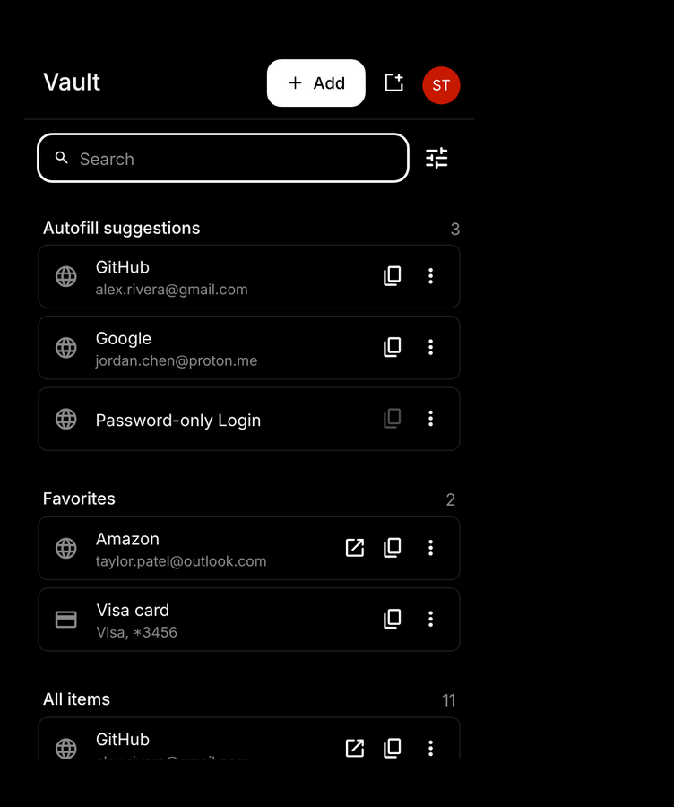

<p align="center">
  
</p>
<p align="center">
  <a href="https://github.com/bitwarden/clients/actions/workflows/build-browser.yml?query=branch:main" target="_blank"></a>
  <a href="https://github.com/bitwarden/clients/actions/workflows/build-cli.yml?query=branch:main" target="_blank"></a>
  <a href="https://github.com/bitwarden/clients/actions/workflows/build-desktop.yml?query=branch:main" target="_blank"></a>
  <a href="https://github.com/bitwarden/clients/actions/workflows/build-web.yml?query=branch:main" target="_blank"></a>
</p>

---

# Bitwarden Client Applications

This repository houses all Bitwarden client applications except the mobile applications ([iOS](https://github.com/bitwarden/ios) | [android](https://github.com/bitwarden/android)).

Please refer to the [Clients section](https://contributing.bitwarden.com/getting-started/clients/) of the [Contributing Documentation](https://contributing.bitwarden.com/) for build instructions, recommended tooling, code style tips, and lots of other great information to get you started.

## Download the browser extension (Black theme build)

This fork adds a minimal, pure-black **Black** theme to the browser extension. To try it before it is in a store release:

**Option 1 — download a CI build**

1. Open the [Build Browser workflow runs](https://github.com/vhgn/bitwarden-clients/actions/workflows/build-browser.yml) and pick the latest successful run for your branch or pull request.
2. Under **Artifacts**, download the build for your browser:
   - Chrome / Brave / Arc: `dist-chrome-MV3-<build>.zip`
   - Edge: `dist-edge-MV3-<build>.zip`
   - Firefox: `dist-firefox-<build>.zip`
   - Opera: `dist-opera-MV3-<build>.zip`
3. Unzip it (GitHub wraps the archive in a second zip, so you may need to unzip twice).

**Option 2 — build it yourself**

```bash
npm ci
cd apps/browser
npm run build:chrome   # or build:firefox, build:edge, build:opera
```

The unpacked extension is written to `apps/browser/build`.

**Load the extension**

- **Chrome / Edge / Brave / Opera:** go to `chrome://extensions`, turn on **Developer mode**, click **Load unpacked** and select the unzipped folder (or `apps/browser/build`).
- **Firefox:** go to `about:debugging#/runtime/this-firefox`, click **Load Temporary Add-on…** and select the `manifest.json` in the folder.

**Turn on the Black theme:** open the extension, go to **Settings → Appearance → Theme** and choose **Black**.

<p align="center">
  
</p>

## Related projects:

- [bitwarden/server](https://github.com/bitwarden/server): The core infrastructure backend (API, database, Docker, etc).
- [bitwarden/ios](https://github.com/bitwarden/ios): Bitwarden iOS Password Manager & Authenticator apps.
- [bitwarden/android](https://github.com/bitwarden/android): Bitwarden Android Password Manager & Authenticator apps.
- [bitwarden/directory-connector](https://github.com/bitwarden/directory-connector): A tool for syncing a directory (AD, LDAP, Azure, G Suite, Okta) to an organization.

# We're Hiring!

Interested in contributing in a big way? Consider joining our team! We're hiring for many positions. Please take a look at our [Careers page](https://bitwarden.com/careers/) to see what opportunities are [currently open](https://bitwarden.com/careers/#open-positions) as well as what it's like to work at Bitwarden.

# Contribute

Code contributions are welcome! Please commit any pull requests against the `main` branch. Learn more about how to contribute by reading the [Contributing Guidelines](https://contributing.bitwarden.com/contributing/). Check out the [Contributing Documentation](https://contributing.bitwarden.com/) for how to get started with your first contribution.

Security audits and feedback are welcome. Please open an issue or email us privately if the report is sensitive in nature. You can read our security policy in the [`SECURITY.md`](SECURITY.md) file.
